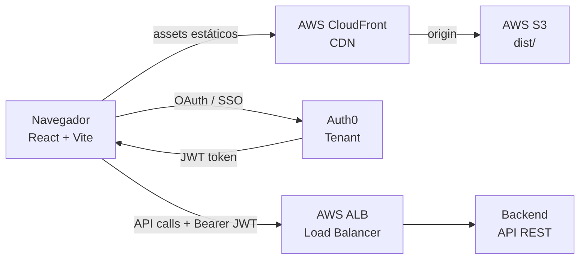

# GestTask — Frontend

> Gestor de tareas estilo Kanban con autenticación dual, pipelines configurables y panel de administración.

[](https://vitejs.dev/)
[](https://react.dev/)
[](https://www.typescriptlang.org/)
[](https://tailwindcss.com/)
[](https://auth0.com/)
[](https://aws.amazon.com/)

---

## Descripción

GestTask es una aplicación de gestión de tareas que permite a equipos organizar su trabajo en tableros Kanban. Cada tablero contiene pipelines con etapas personalizadas; las tareas se mueven entre etapas mediante drag & drop. Incluye sistema de roles (owner / miembro / invitado), comentarios con adjuntos y un panel de administración para usuarios con rol `admin`.

Este repositorio es el **frontend** de GestTask. El backend (FastAPI/Node) se consume a través de una URL configurada por variable de entorno.

---

## Funcionalidades

| Categoría | Detalle |
|-----------|---------|
| **Autenticación dual** | Login/registro con email y contraseña + SSO via Auth0 (Google/social) |
| **Tableros** | Crear, listar y eliminar tableros personales |
| **Pipelines** | Crear pipelines con etapas ordenadas dentro de un tablero |
| **Kanban drag & drop** | Mover tareas entre etapas con react-dnd (HTML5 Backend) |
| **Tareas** | Crear, editar (título, descripción, prioridad, estado, responsable, fecha límite), eliminar |
| **Comentarios y adjuntos** | Agregar comentarios con archivos adjuntos (multipart); descarga via URL firmada |
| **Gestión de miembros** | Agregar/remover miembros de un tablero y cambiar roles (owner / miembro / invitado) |
| **Panel de administración** | Resumen global del sistema (usuarios, tableros, pipelines, tareas, comentarios) y gestión de usuarios |
| **Sistema de roles** | La UI se adapta según el rol: owner puede administrar, miembro puede crear/mover, invitado es sólo lectura |

---

## Arquitectura general



El frontend es una SPA completamente estática (sin SSR). Se sirve desde S3 vía CloudFront. Toda la lógica de negocio reside en el backend.

---

## Árbol de componentes

```
App.tsx                         ← máquina de estados (login | register | dashboard)
├── LoginPage.tsx               ← login email/password + botón Auth0
├── RegisterPage.tsx            ← registro de usuario
└── Dashboard.tsx               ← vista principal post-autenticación
    ├── AdminDashboard.tsx      ← panel admin (sólo rol admin)
    │   └── UserDetailModal.tsx
    ├── BoardView.tsx           ← detalle de un tablero
    │   ├── PipelineView.tsx    ← vista de pipeline con etapas (DndProvider aquí)
    │   │   ├── StageColumn.tsx ← columna de etapa (useDrop)
    │   │   │   └── TaskCard.tsx ← tarjeta de tarea (useDrag)
    │   │   └── TaskDetailModal.tsx ← detalle de tarea + comentarios + adjuntos
    │   ├── CreatePipelineModal.tsx
    │   └── ManageMembersModal.tsx
    ├── CreateBoardModal.tsx
    └── CreateTaskModal.tsx
```

---

## Comenzar a trabajar localmente

### Prerrequisitos

- Node.js 18+
- Una cuenta Auth0 con una aplicación SPA configurada
- El backend de GestTask corriendo (localmente o en la nube)

### Instalación

```bash
git clone https://github.com/Wgutierrezl/GestTask_FR.git
cd GestTask_FR
git checkout GT_Front_Oauth0
npm install
```

### Configuración del entorno

Copiá `.env.example` a `.env` y completá los valores:

```bash
cp .env.example .env
```

```env
VITE_API_URL=http://localhost:8097
VITE_AUTH0_DOMAIN=your-tenant.us.auth0.com
VITE_AUTH0_CLIENT_ID=your-auth0-spa-client-id
VITE_AUTH0_AUDIENCE=https://your-api-identifier/
```

> **Nota sobre las credenciales Auth0**: el `VITE_AUTH0_CLIENT_ID` es el Client ID de una aplicación de tipo **SPA (Single Page Application)** en Auth0. Este valor es público por diseño del protocolo OAuth 2.0 — Auth0 SPA apps no tienen client secret. Aun así, no lo expongas en un README público con los valores reales de producción.

### Correr en modo desarrollo

```bash
npm run dev
```

La aplicación estará disponible en `http://localhost:5173`.

---

## Variables de entorno

| Variable | Requerida | Descripción |
|----------|-----------|-------------|
| `VITE_API_URL` | ✅ | URL base del backend GestTask (ej: `http://localhost:8097` o la URL del ALB/CloudFront) |
| `VITE_AUTH0_DOMAIN` | ✅ | Dominio del tenant Auth0 (ej: `tu-tenant.us.auth0.com`) |
| `VITE_AUTH0_CLIENT_ID` | ✅ | Client ID de la aplicación SPA en Auth0. **Es un valor público por diseño del protocolo OAuth 2.0 PKCE.** |
| `VITE_AUTH0_AUDIENCE` | ✅ | Identificador de la API en Auth0 (ej: `https://gesttaskapi/`). Se usa para solicitar un JWT con el scope correcto. |

Todas las variables deben comenzar con el prefijo `VITE_` para que Vite las exponga al bundle del navegador.

---

## Despliegue

El pipeline de CI/CD está definido en `.github/workflows/deploy.yml` y se activa automáticamente al hacer push a las ramas de deploy:

| Rama | Entorno | Destino |
|------|---------|---------|
| `GT_Front_Oauth0_Dev` | Staging | S3 `s3-website-gesttask-dev` |
| `GT_Front_Oauth0_Prod` | Producción | S3 `s3-website-gesttask-prod` |

**Flujo del pipeline:**

1. Checkout del código
2. Setup Node 18
3. `npm ci`
4. Inyección del `.env` desde los secrets de GitHub Actions
5. `npm run build` → genera `dist/`
6. `aws s3 sync dist/ s3://...` → upload al bucket correspondiente

Los assets en S3 quedan disponibles vía CloudFront en la URL pública del distribution.

### Estado del despliegue

> **Demo offline.** El proyecto estuvo desplegado en AWS S3 + CloudFront (entornos de test y producción) con dominio vía CloudFront, activado automáticamente a través de GitHub Actions. La cuenta AWS fue cerrada y la infraestructura ya no está activa. El código y el pipeline de CI/CD están completos y funcionales para ser redesplegados.

Para ver el proyecto en funcionamiento es necesario configurar el `.env` local y tener el backend corriendo.

---

## Guía de ramas

| Rama | Propósito |
|------|-----------|
| `main` | Scaffold inicial de Vite — **no es el código real del proyecto** |
| `GT_Front` | Primera iteración: funcionalidades básicas sin Auth0 |
| `GT_Front_V2` | Segunda iteración: mejoras de pipeline/board, sin Auth0 |
| `GT_Front_Oauth0` | **Rama canónica de desarrollo** — Auth0 integrado, desarrollo activo |
| `GT_Front_Oauth0_Dev` | Target de deploy automático → entorno de staging en AWS |
| `GT_Front_Oauth0_Prod` | Target de deploy automático → entorno de producción en AWS |

**Rama recomendada para clonar y explorar: `GT_Front_Oauth0`**

---

## Limitaciones conocidas

- **Sin react-router**: la navegación entre vistas se implementa con una máquina de estados (`useState`) en `App.tsx`. No hay URLs por vista, el botón "atrás" del navegador no funciona y no hay deep linking.
- **Sin tests**: no hay framework de testing configurado (ni unitario, ni de integración, ni E2E).
- **Linter deshabilitado en CI**: el paso de lint está comentado en el workflow de GitHub Actions.

---

## Tecnologías

| Herramienta | Versión | Rol |
|-------------|---------|-----|
| Vite | 7 | Build tool y dev server |
| React | 19 | UI framework |
| TypeScript | 5.9 | Tipado estático |
| Tailwind CSS | 4 | Estilos (vite plugin, sin archivo de configuración) |
| @auth0/auth0-react | 2.11 | SDK de Auth0 para SPA |
| axios | 1.13 | Cliente HTTP |
| react-dnd | 16 | Drag & drop (HTML5 Backend) |
| framer-motion | 12 | Animaciones |
| sweetalert2 | 11 | Diálogos de confirmación/alerta |
| lucide-react | — | Iconografía |
