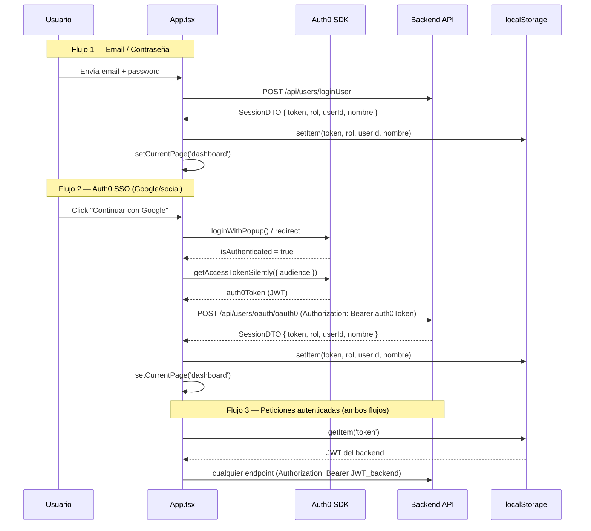

# Arquitectura — GestTask Frontend

> Documento técnico para el proyecto GestTask Frontend (`GT_Front_Oauth0`).  
> Rama canónica: `GT_Front_Oauth0` | Stack: Vite 7 + React 19 + TypeScript 5.9

---

## Árbol de componentes

```
src/
├── main.tsx                        ← Entry point. Monta Auth0Provider envolviendo App.
├── App.tsx                         ← Máquina de estados (login|register|dashboard).
│                                     Define todos los tipos de dominio compartidos.
│                                     Maneja la sincronización del token Auth0 → backend.
│
├── components/
│   ├── LoginPage.tsx               ← Formulario email/password + botón "Continuar con Google" (Auth0)
│   ├── RegisterPage.tsx            ← Formulario de registro de usuario
│   │
│   ├── Dashboard.tsx               ← Vista principal. Carga tableros del usuario vía GetMyBoards.
│   │                                 Renderiza la lista de tableros y el acceso al AdminDashboard.
│   │
│   ├── AdminDashboard.tsx          ← Panel admin (visible sólo para rol "admin").
│   │                                 Llama a getDashboardSummary y GetAllUsers.
│   │   └── UserDetailModal.tsx     ← Modal con detalle de usuario individual.
│   │
│   ├── BoardView.tsx               ← Detalle de un tablero. Lista pipelines. Gestión de miembros.
│   │   ├── PipelineView.tsx        ← Vista de un pipeline. Aquí vive el DndProvider (HTML5Backend).
│   │   │                             Lista etapas en columnas.
│   │   │   ├── StageColumn.tsx     ← Columna de etapa. Receptor de drop (useDrop de react-dnd).
│   │   │   │                         Renderiza las TaskCards de la etapa.
│   │   │   └── TaskCard.tsx        ← Tarjeta de tarea. Fuente de drag (useDrag de react-dnd).
│   │   │                             Al soltar sobre otra columna llama a UpdateStageTaskId.
│   │   │
│   │   ├── TaskDetailModal.tsx     ← Detalle completo de una tarea. Edición de campos.
│   │   │                             Lista de comentarios con adjuntos. Descarga de archivos.
│   │   ├── CreatePipelineModal.tsx ← Formulario para crear un pipeline con sus etapas.
│   │   └── ManageMembersModal.tsx  ← Agregar/remover miembros y cambiar roles en un tablero.
│   │
│   └── CreateBoardModal.tsx        ← Formulario para crear un tablero.
│       CreateTaskModal.tsx         ← Formulario para crear una tarea dentro de un pipeline.
│
├── functions/
│   ├── ApiReutilizable.ts          ← Instancia axios principal con interceptor de autenticación.
│   ├── auth0Api.ts                 ← Instancia axios secundaria para el handshake OAuth con el backend.
│   │
│   ├── oAuth0_functions/
│   │   └── oAuth0.functions.ts    ← loginWithOauth0Backend(auth0Token) → SessionDTO
│   ├── user_functions/
│   │   └── user.ts                ← LogUser, GetProfile, RegisterUser, GetAllUsers
│   ├── board_functions/
│   │   └── board.functions.ts     ← CreateBoard, GetMyBoards, DeleteBoardById, GetBoardByUserId
│   ├── board_members_functions/
│   │   └── board_member_functions.ts ← GetBoardsMemberByBoardId, AddBoardMember, RemoveBoardMember, ChangeRoleBoardMember
│   ├── pipelines_functions/
│   │   └── pipeline.functions.ts  ← CreatePipeline, GetPipelinesByBoardId, DeletePipelineById
│   ├── task_functions/
│   │   └── task.functions.ts      ← CreateTask, GetTasksByPipelineId, DeleteTaskById, UpdateTaskById, UpdateStageTaskId
│   ├── comments_functions/
│   │   └── comments.functions.ts  ← AddComment (multipart FormData), GetCommentsByTaskId, DownloadFileByUrl
│   ├── dashboard_functions/
│   │   └── dashboard.functions.ts ← getDashboardSummary, getUserDashboardByUserId, getUserBoardSummary
│   │
│   └── models/
│       ├── LoginDTO.ts            ← LoginDTO, SessionDTO
│       ├── UserInfoDTO.ts         ← UserInfo, UserCreate
│       ├── Board_model.ts         ← BoardCreate, BoardInfoDTO, BoardMemberDTO, BoardMemberInfoDTO
│       ├── Pipeline_model.ts      ← EtapasDTO, EtapasInfoDTO, pipelinesDTO, PipelinesInfo
│       ├── Task_model.ts          ← TaskDTO, TaskInfoDTO, TaskUpdate (Prioridad, Estado)
│       ├── Stage_models.ts        ← StageDTO
│       ├── comment_model.ts       ← CreateCommentDTO, CommentInfo, FilesDTO, SessionFileDTO
│       └── Dashboard_model.ts     ← DashboardDTO, DashboardUserDTO, DashboardBoardDTO
│
├── figma/
│   └── ImageWithFallback.tsx      ← Componente de imagen con fallback para assets de Figma
└── styles/
    └── global.css                 ← Estilos globales base (Tailwind CSS 4 via vite plugin)
```

---

## Flujo de autenticación



**Puntos clave del flujo:**

1. `Auth0Provider` en `main.tsx` envuelve toda la aplicación — Auth0 SDK disponible en cualquier componente vía `useAuth0()`.
2. `App.tsx` observa `isAuthenticated` con `useEffect`. Cuando cambia a `true`, llama a `getAccessTokenSilently` y luego intercambia el token Auth0 por un JWT del propio backend.
3. El JWT del backend se persiste en `localStorage`. Esto permite que la sesión sobreviva a recargas de página (mientras el token sea válido).
4. El interceptor en `ApiReutilizable.ts` lee `localStorage.getItem('token')` en cada petición y lo agrega como `Authorization: Bearer`.

---

## Diseño de las dos instancias axios

El proyecto tiene dos instancias axios con responsabilidades distintas:

### `api` — `src/functions/ApiReutilizable.ts`

```
baseURL: import.meta.env.VITE_API_URL
```

Es la instancia principal para todas las llamadas autenticadas al backend. Tiene un **interceptor de request** que:

1. Verifica si la petición tiene el header `skipAuth` → si está presente, omite el token (usado para login y registro donde el usuario aún no tiene sesión).
2. Si no tiene `skipAuth`, lee `localStorage.getItem('token')` y agrega `Authorization: Bearer <token>`.

Usada por: todas las funciones en `functions/**/*.ts` excepto el handshake OAuth.

### `auth0Api` — `src/functions/auth0Api.ts`

```
baseURL: import.meta.env.VITE_API_URL
```

Instancia sin interceptor. Se usa exclusivamente para el endpoint OAuth (`POST /api/users/oauth/oauth0`) donde el token a enviar es el JWT de Auth0 (no el del backend), lo que hace que el interceptor de `api` sea incorrecto para este caso. La separación evita la colisión de tokens.

---

## Matriz de roles

| Acción | owner | miembro | invitado |
|--------|:-----:|:-------:|:--------:|
| Ver tablero y tareas | ✅ | ✅ | ✅ |
| Crear tarea | ✅ | ✅ | ❌ |
| Editar tarea | ✅ | ✅ | ❌ |
| Mover tarea (drag & drop) | ✅ | ✅ | ❌ |
| Eliminar tarea | ✅ | ❌ | ❌ |
| Crear pipeline | ✅ | ❌ | ❌ |
| Eliminar pipeline | ✅ | ❌ | ❌ |
| Agregar miembro al tablero | ✅ | ❌ | ❌ |
| Remover miembro | ✅ | ❌ | ❌ |
| Cambiar rol de miembro | ✅ | ❌ | ❌ |
| Eliminar tablero | ✅ | ❌ | ❌ |
| Ver panel admin | sólo si rol global = `admin` | ❌ | ❌ |

> El rol `admin` es un rol global del sistema (no del tablero). Los roles `owner`, `miembro` e `invitado` son roles por tablero, almacenados en la entidad `BoardMember` del backend.

---

## Enfoque de estado

GestTask Frontend **no usa ningún store global** (sin Zustand, Redux, Context API para datos de negocio).

**Decisión deliberada:** toda la información de negocio se obtiene directamente del backend cuando se monta el componente que la necesita. El estado se maneja con `useState` local por componente.

**Consecuencias:**

- `Dashboard.tsx` carga la lista de tableros con `GetMyBoards` al montarse.
- `BoardView.tsx` carga los pipelines al montarse.
- `PipelineView.tsx` carga las tareas por etapa al montarse.
- No hay caché compartida entre componentes — si se actualiza una tarea en el modal y se cierra, el pipeline recarga las tareas.

**Ventajas de esta decisión:** menor complejidad, sin boilerplate de store, datos siempre frescos del servidor.

**Desventaja:** mayor cantidad de peticiones HTTP; sin datos optimistas (optimistic updates).

La única persistencia del lado cliente es la sesión en `localStorage` (token, rol, userId, nombre).

---

## Catálogo de endpoints consumidos

| Método | Endpoint | Función | Auth requerida |
|--------|----------|---------|----------------|
| `POST` | `/api/users/loginUser` | `LogUser` | No (`skipAuth`) |
| `GET` | `/api/users/getProfile` | `GetProfile` | Sí |
| `POST` | `/api/users/registerUser` | `RegisterUser` | No (`skipAuth`) |
| `GET` | `/api/users/getAllUsers` | `GetAllUsers` | Sí |
| `POST` | `/api/users/oauth/oauth0` | `loginWithOauth0Backend` | Auth0 JWT (via `auth0Api`) |
| `GET` | `/api/boards/getMyBoards` | `GetMyBoards` | Sí |
| `POST` | `/api/boards/createBoard` | `CreateBoard` | Sí |
| `DELETE` | `/api/boards/deleteBoardById/:id` | `DeleteBoardById` | Sí |
| `GET` | `/api/boards/getBoardByOwnerId/:userId` | `GetBoardByUserId` | Sí |
| `GET` | `/api/boardMembers/getAllMemberByBoardId/:boardId` | `GetBoardsMemberByBoardId` | Sí |
| `GET` | `/api/boardMembers/getMemberByBoardIdAndUser/:boardId` | — | Sí |
| `POST` | `/api/boardMembers/addMember` | `AddBoardMember` | Sí |
| `DELETE` | `/api/boardMembers/deleteBoardMemberById/:id/boardId/:boardId` | `RemoveBoardMember` | Sí |
| `PUT` | `/api/boardMembers/updateBoardMemberById/:id` | `ChangeRoleBoardMember` | Sí |
| `POST` | `/api/pipelines/createPipelines/boardId/:tableroId` | `CreatePipeline` | Sí |
| `GET` | `/api/pipelines/getPipelinesByBoardId/:tableroId` | `GetPipelinesByBoardId` | Sí |
| `DELETE` | `/api/pipelines/deletePipelinesById/:pipelineId/boardId/:boardId` | `DeletePipelineById` | Sí |
| `POST` | `/api/tasks/createTask/boardId/:boardId` | `CreateTask` | Sí |
| `GET` | `/api/tasks/getAllTaskByPipeId/:pipelineId` | `GetTasksByPipelineId` | Sí |
| `DELETE` | `/api/tasks/deleteTaskById/:id/boardId/:boardId` | `DeleteTaskById` | Sí |
| `PUT` | `/api/tasks/updateTask/:id/boardId/:boardId` | `UpdateTaskById` | Sí |
| `PUT` | `/api/tasks/updateStageTaskId/:taskId/boardId/:boardId` | `UpdateStageTaskId` | Sí |
| `POST` | `/api/comments/createComment/boardId/:boardId` | `AddComment` | Sí (multipart FormData) |
| `GET` | `/api/comments/getAllCommentsByTaskId/:taskId` | `GetCommentsByTaskId` | Sí |
| `GET` | `/api/comments/downloadFile/:commentId/file/:fileId` | `DownloadFileByUrl` | Sí |
| `GET` | `/api/dashboard/getDashboardSummary` | `getDashboardSummary` | Sí |
| `GET` | `/api/dashboard/getUserDashboardSummary/:userId` | `getUserDashboardByUserId` | Sí |
| `GET` | `/api/dashboard/getUserBoardDashboardSummary/:userId` | `getUserBoardSummary` | Sí |
